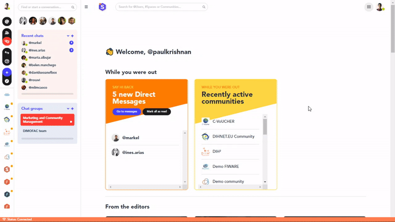

### **How to change your desktop and mobile push notification settings**

1. Click on your profile picture on the top-left part of the page and then click on *Manage my account*.
2. Go to the *Notification settings* section.
3. You then have the choice to modify different kinds of notifications:
* **Email notification settings** refer to email alerts for various kinds of interactions that are taking place in the platform (someone sent you a direct message, new content in one of your communities, etc.).
* **Email news and updates** refers to the newsletters that we send and that related to our funding opportunities, events or product releases.
* **Web and mobile push notifications preferences** refer to the push notifications that you can receive either on your desktop or your mobile based on the interactions that are taking place in the platform (new content in one of your communities, etc.).
4. Tick or untick the box related to each of these sections to activate or deactivate these notifications.

    

