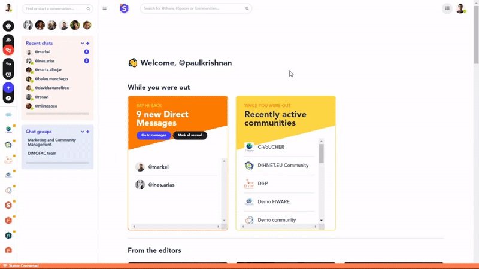

### **How to link your profile to an organisation**

1. Click on your profile picture on the top-left part of the page and then click on *Manage my account*.
2. Go to the *Organisations* section.
3. Fill in the required information of the organisation you want to be affiliated with.
4. Click on *Create this organisation* at the bottom of the form.
5. That’s it! The organisation legal info associated with your account will be used to speed up the process when applying to funding opportunities.

