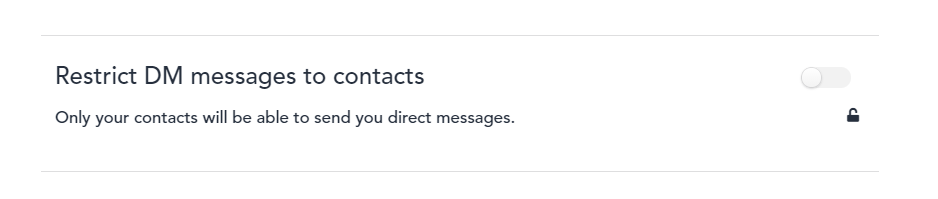
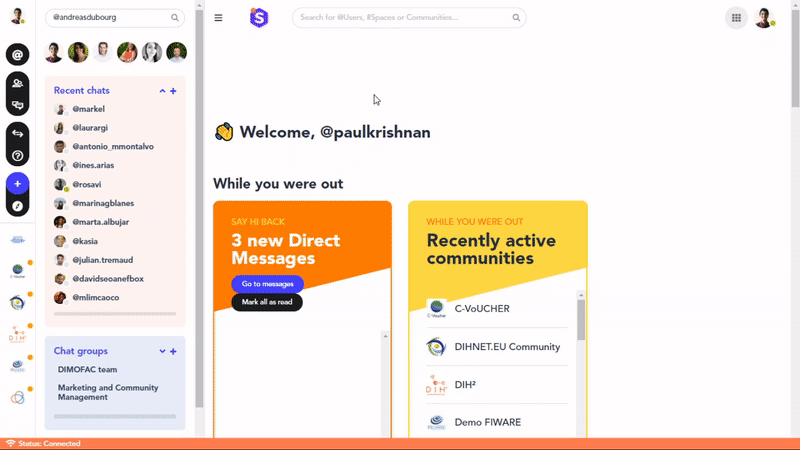

### **Why would you want to add a contact to your network?**

On the FundingBox Platform, you can by default start a conversation with any other user. Hence, connecting with other users is not necessarily a must to start networking.
However, some users, including yourself may decide in their *Data & Privacy* settings to restrict messaging possibilities with contacts only. In this case, it is only by adding these users to your network that you will be able to chat with them.

### Option 1

1. Click on the *Quick jump* button on the left-hand side navigation menu.
2. In the window that opens, search for the user with whom you would like to connect.
3. You will access a private chat with the user, click *Connect* on the panel on the right to send an invitation.
4. The user will receive an email connection inviting him or her to connect with you.

### Option 2

1. Click on the *My Connections* button on the left-hand side navigation menu.
2. In the window that opens, click on *Invite people*.
3. In the search bar, type the name of the user with whom you would like to connect.
4. Once the user appears in the suggested results, click on him or her.
5. The user will receive an email connection inviting him or her to connect with you

