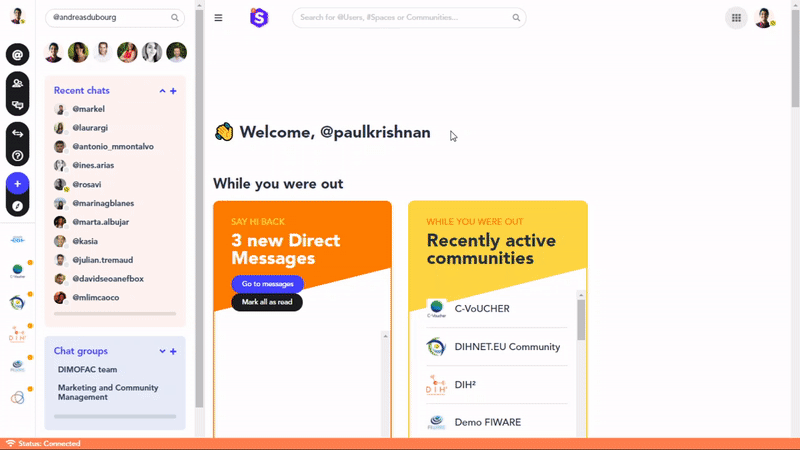

### **How to make a (video) call in a chat?**

Would a 5-minute call maybe clarify what a written conversation could not do in three times those 5 minutes? Let’s see how to make a video call on the FundingBox platform.

1. Click on the *Quick jump* button on the left-hand side navigation menu.
2. In the window that opens, search for the user with whom you would like to make a video call and click on him/her.
3. You will access a private chat with the user, click *Meet now* on the panel on the right to send an invitation.
4. A window will open, click on *Join the meeting*. The other user should join soon.

