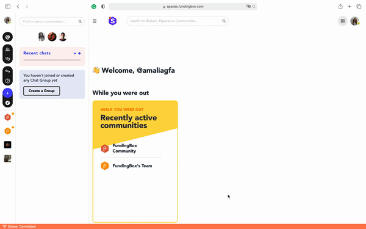

### **How to create a community?**

1. On the left-hand side menu click on the *"+"* icon.
2. When you click on it, you will confirm your selection with a pop-up message *Start a Community*.
3. You now have your community created, well done! What to do next? Access the Community Settings and then go to the *Launch Checklist*. You will be able to view a list of actions that can help you to design and promote your community.

