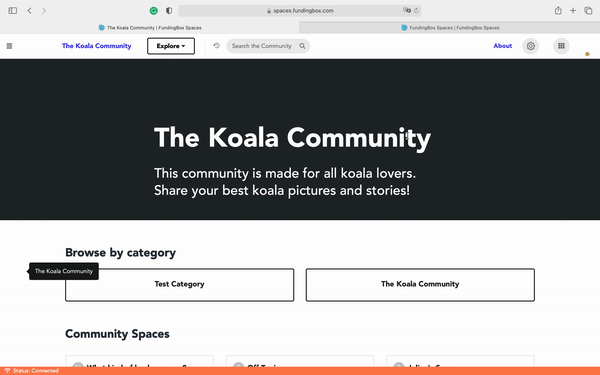

### **How to make your community private or public?**

1. Go to the page of the community you are managing.
2. Open the Community settings in a community that you manage. You can access it by clicking on the "Gear" icon at the top right of your screen of your chosen community and selecting *Manage this Community* from the dropdown menu.
3. In the tab General, swipe the lock switch following the privacy settings you would like to have for your community. 

:::note
If you make your community private, your community will no longer be visible and potential members will need an access code as well as an invitation link to become members.
:::

