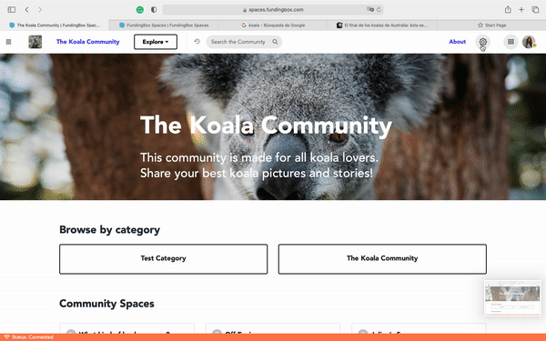

### **Why showcasing content on the homepage?**

Your community by default displays at the top, below the banner, its categories and community spaces which is great for users to immediately join a specific conversation once they land on the community homepage.

However, what if it's the first time they come to the community and do not know where to start? Wouldn't showcasing a "First steps" article on the homepage be helpful? 
What if as an administrator of a community, you would like to showcase the video of an event that many members joined? 
Similarly, wouldn't it be useful to make temporarily available and visible the link to the video directly on the homepage? 

Well, it is possible!

### **How to showcase content on the homepage?**

1. Go to the page of the community you are managing.
2. Open the Community settings in a community that you manage. You can access them by clicking on the "Gear" icon at the top right of your screen of your chosen community and selecting *Manage this Community* from the dropdown menu.
3. In the tab *Homepage*, click on *Add a Section*.
4. There are four types of sections you may add: Content block, Promo Banner, HTML Block and Text Block. Use whichever option best suits your needs.
5. You may edit the order of the sections displayed on your homepage.

1
