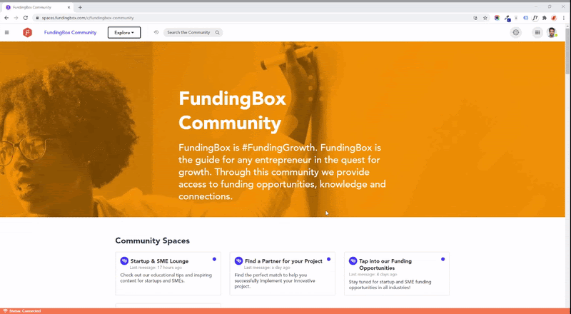

### **How to delete your account?**

1. Open your [Account Settings](https://accounts.fundingbox.com/account). You can access the page by clicking your avatar picture on the top-left corner of the left-side menu panel and then clicking _Manage my account_ in the dropdown menu.
2. On your account page, scroll down to the section titled _Danger Zone_ and _Delete your account_. 

:::note 
Please, note that this option will completely remove all your user data from our database and that this action is permanent and can't be reverted. To completely remove your data, FundingBox needs permission from the other data operators or partners within its platform, if you have data shared with them. If you have joined a community on our platform or accepted to share your data with third parties through our platform, a list of these communities and third parties will be displayed on your screen. Click the button below this table labeled “Send a notification to all partners and flag my account for removal” to delete your account and all your data from our servers.
:::

