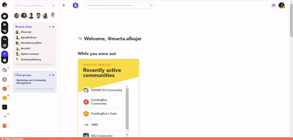

### **How to get personalised recommendations in your home feed?**

You can easily edit and select the topics and markets you are interested in across the Fundingbox Communities. This way, your home feed will offer you a curated selection of content.

1. Click on your avatar picture on the top-left corner of the menu panel.
2. In the menu that appears, click on *View my profile.*
3. When your profile page is displayed, click on *Edit profile*.
4. Scroll down to see the *Markets and topics you are interested in* section. 
5. Click on *Edit topics* to be able to edit the topics you like. 

