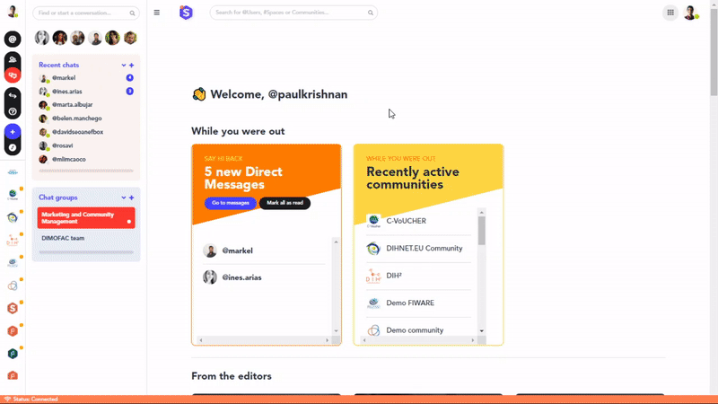

### **How to manage your data and privacy settings**

1. Click on your profile picture on the top-left part of the page and then click on *Manage my account*.
2. Go to the *Data and Privacy* section.
3. You land on a page on which you can activate or deactivate some options to make your profile more or less confidential. 
   1. You can for instance:
      * **Hide your profile** from unregistered users and search engines (e.g. Google).
      * Make sure **only your contacts will be able to send you direct messages**.
   2. Moreover, by scrolling down, you can visualise all the data that you can share with third parties in open calls and communities. You then have the option to access the calls and communities to leave them in case you no longer wish to share your data.
   3. Lastly, remember that you can export all your account data in a file so that you have a backup.

