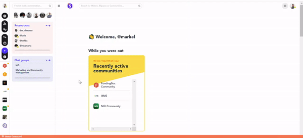

### **How to access your group chats?**

Access a DM Group from the left-hand side navigation menu:
1. On the left menu panel, below Chat Group will be listed all the DM groups you belong to. Click on the one you wish to access.
2. You will land on a messaging interface of your DM group, you can start chatting with the members.

