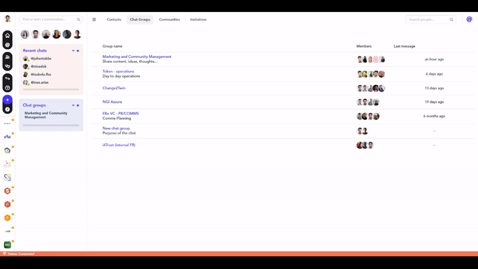

### **How to create a group chat?**

To create a new chat group, visit [this quick link](https://spaces.fundingbox.com/spaces/add) or follow the instructions below:

1. On the left-hand side navigation menu, click the *"+"* symbol in the *Chat groups* box.
2. Fill in the form with the name of the group, its purpose (optional) and the contacts you want to add to the group.
3. Click the *Create group* button.

The form will redirect you to the messaging interface for your newly created private chat group.

