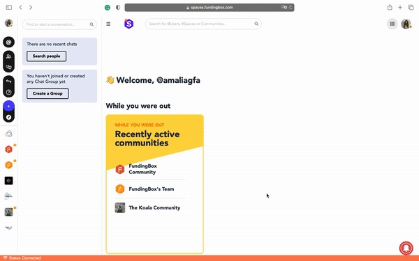
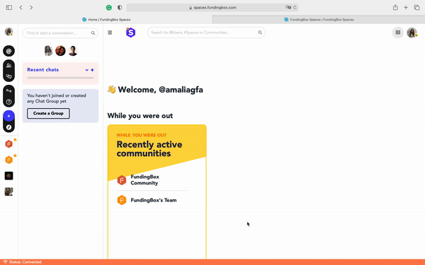

### **How to join a community?**

**Option 1**

1. On the left-hand side menu, click on *Quick search* and look for the community you wish to join.
2. You will land on the community of your choice, click on *Join the community*.

**Option 2**

You can also join any of the public communities on the left-hand side menu under the compass icon.

When you click on it, you will confirm your selection with a pop-up message on Explore Public Communities.
Join any community of interest.

