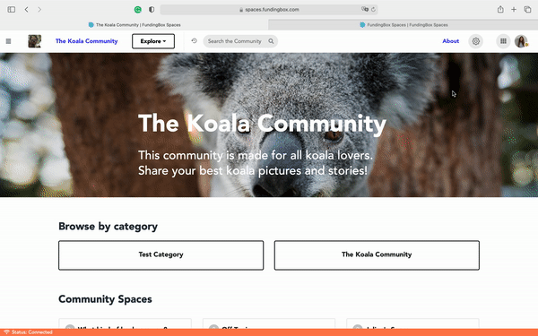

### **How to make a community live or archive it?**

1. Go to the page of the community you are managing.
2. Open the Community settings in a community that you manage. You can access it by clicking on the "Gear" icon at the top right of your screen of your chosen community and selecting *Manage this Community* from the dropdown menu.
3. In the tab *General*, in the dropdown menu and select the community status you would like to have for your community: 
   * Published (your community is live and by default visible to everyone), 
   * Draft (your community is still under construction and is not visible), or 
   * Archived (your community has done its time and is no longer visible).

