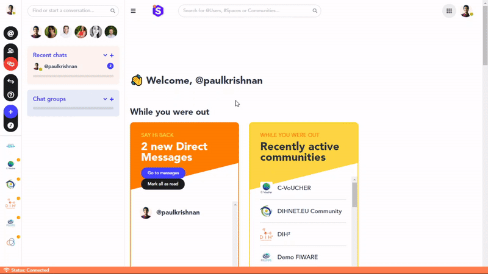

### **How to join or start a private chat?**

You would like to start networking with another user on the platform? Here is how to start a private chat:

1. Click on the *Quick jump* button on the left-hand side navigation menu.
2. In the window that opens, search for the user with whom you would like to start chatting.
3. You will access a private chat with the user. If he or she is already part of your network of contacts, you will be able to start a conversation right away.

