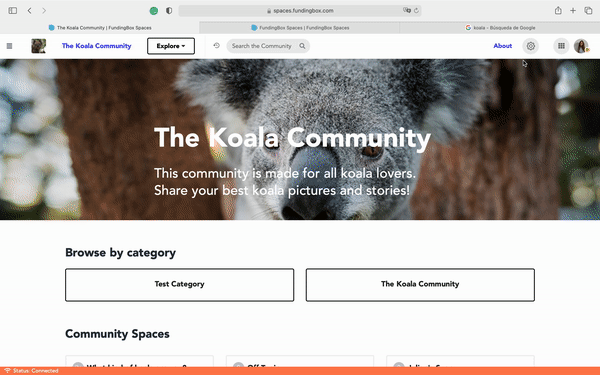

### **How to change the logo and the banner of your community?**

1. Go to the page of the community you are managing.
2. Open the Community settings in a community that you manage. You can access it by clicking on the "Gear" icon at the top right of your screen of your chosen community and selecting *Manage this Community* from the dropdown menu.
3. In the tab *Branding*, click on:
   * *Change icon* and upload the logo and/or
   * *Change hero image* and upload your banner, depending on what you want to change.

