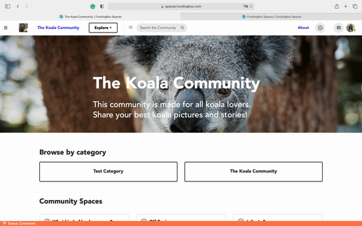

### **How to change the community name, URL, tagline and description?**

1. Go to the page of the community you wished to administer.
2. On the top-right corner click on the 'gear' icon for Community Settings.
3. A sub-menu will pop-up, click on *Manage this Community*. In the tab *General*, click on:
   * *Change name & URL*. 
   * *Change tagline* and/or 
   * *Change about text* (for description), depending on what you want to change.

:::note
To do any of these actions you need to have created a community or you are an administrator or IT.
:::

