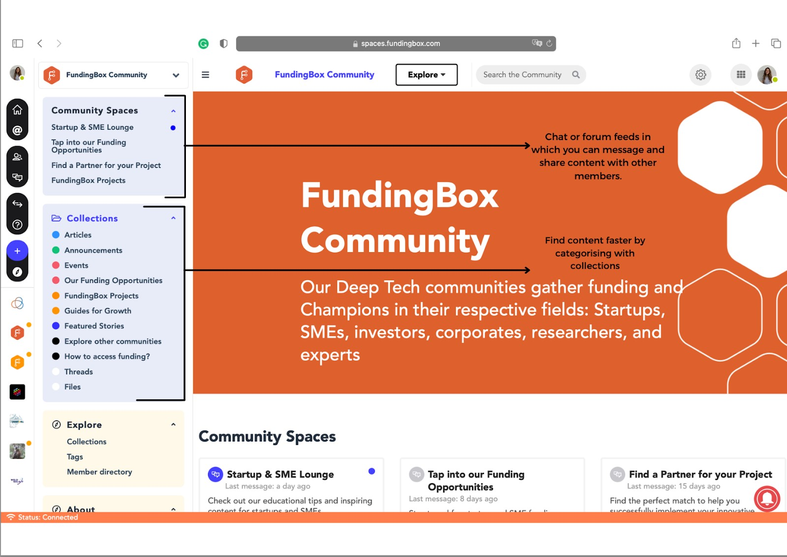

### **What is a community?**

A community is a social channel gathering people that are: 
1. sharing a common interest in a given topic and 
2. willing to help each other in the completion of their goals related to this topic. 

The communities on the FundingBox Platform are dedicated to specific deep tech topics such as Smart Mobility, Robotics, Decentralised Technologies or Circular Economy. 

Thanks to the messaging, content sharing and content organization functionalities, members can build meaningful connections, grow their knowledge and therefore pursue their goals with more confidence **as they can rely on like-minded individuals happy to support them**.

On the FundingBox Platform, communities are organized in different layers:
* **Categories** that structure all the different kinds of conversations (=Community spaces) that can take place in a given community.
* **Community spaces** which are chat or forum feeds that are grouped in categories and in which you can message and share content with other members.
* **Collections** that structure all the content published in the various Community spaces.

