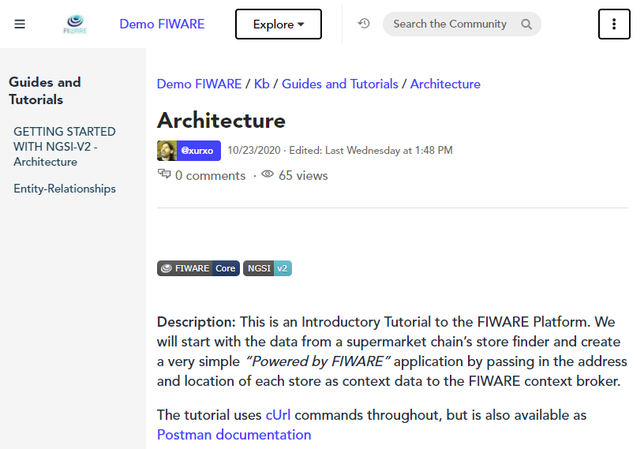

Community Spaces are conversational areas designed for messaging, posting articles, questions and files, hence making people and knowledge accessible all the time by sharing content.

They are accessible to all the members of a community when public or to a restricted number of them when made private -members will need to have a code in the second case.

Community spaces can be of three sorts:
   * Chats, similar to any typical conversation feed.
     
   * Forums, a more structured way to display conversations and an easy way to find answers to frequently asked questions.
     
   * The Knowledge Base Repositories, to store or consult for instance a set of tutorials.
     

Community spaces can be accessed through 2 different areas in the community:
