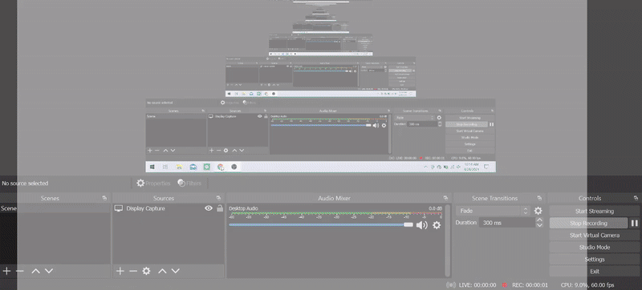

1. Once you are inside the community, access the Community Space of your choice.
2. In the searchable chat history panel (on the right-hand side), click on *Shared files*, *Shared links* or *Pinned messages* to access find files, links and pinned messages that were posted some time ago.

:::info
NB: You can also access files and threads from all Spaces by accessing the Threads or Files collections from the left-hand side menu panel.
:::

