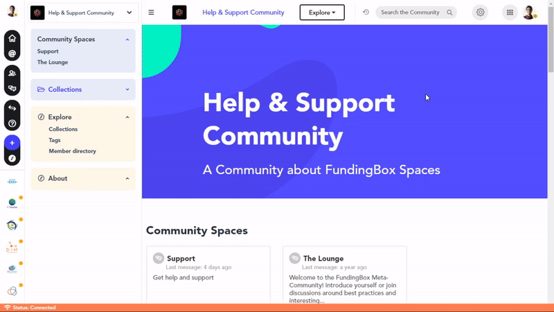

1. Once you are in a community, access the community space of your choice.
2. Click on the bell on the top-right part of the space to activate or deactivate desktop notifications.
3. If you activate them, you will receive a desktop notification whenever a new message, post or file is posted in the space. If you deactivate them, you will stop receiving them.

:::info
NB: By default, when you join a community, notifications from all the community spaces are **turned on**.
:::

